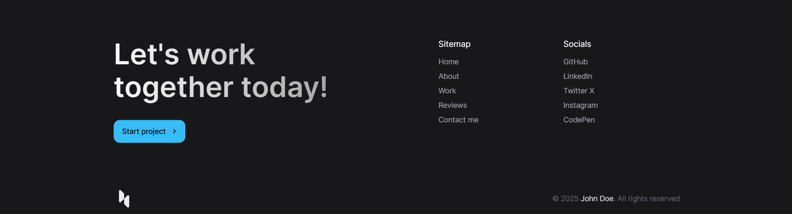

# John Doe Portfolio Website 🌟

Excited to share new sleek and responsive portfolio website! 🚀

This project was a great opportunity for me to take my **TailwindCSS** skills to the next level, while following the fantastic tutorial by [CodeWithSadee](https://www.youtube.com/@codewithsadee). Throughout this journey, I deepened my knowledge of **TypeScript** and also learned how to use the **GSAP** library for stunning, smooth animations that feel natural to the eye. The color selection and typography choices truly elevate the overall experience. Additionally, I implemented **Lenis** for smooth scrolling effects, and **EmailJS** for handling form submissions directly from the frontend in a serverless manner. I also implemented the **Glassmorphism** design style to enhance the visual appeal.

While following his tutorial, I learned a lot, and I also implemented several of the techniques covered to create a truly unique and visually appealing portfolio.

Tutorial link: [CodeWithSadee Tutorial](https://www.youtube.com/watch?v=k3JMkRwd_Nw)

## 🌐 Deployed Website

Check out the live version of the website here:  
🔗 [https://johndoeportfoliowebsite.netlify.app](https://johndoeportfoliowebsite.netlify.app)

## 🎥 Demo Video

Here’s a quick walkthrough of the website in action:

### Website


### Responsive Desgin


### Send Emails


---

## 🚀 Features

- **Responsive Design:** Fully optimized for desktop and mobile views.
- **Smooth Animations:** Stunning, subtle animations using **GSAP**.
- **Glassmorphism Design:** Beautiful glass-like effects applied to various sections of the site.
- **Smooth Scroll Effect:** Seamless scrolling powered by **Lenis**.
- **Email Form Submission:** Integrated **EmailJS** to handle form submissions serverlessly.
- **Scalable Codebase:** Built with **TypeScript** for type safety and maintainability.
- **TailwindCSS Styling:** Fast, efficient, and modern styling with Tailwind’s utility-first framework.

---

## 📸 Screenshots

### Hero Section


### About Section


### Technologies Section


### Projects Section


### Reviews Section


### Contact Section


### Footer Section



### Responsive


---

## 🛠️ Technologies Used

- **React**
- **TypeScript**
- **TailwindCSS**
- **GSAP** (GreenSock Animation Platform)
- **Lenis** (Smooth Scrolling Library)
- **EmailJS** (For form submissions)

---

## 📂 How to Run Locally

1. Clone this repository:

   ```bash
   git clone https://github.com/HrushikeshJoshi187/John_Doe_Portfolio_Website.git
   ```

2. Navigate to the project folder:

   ```bash
   cd John_Doe_Portfolio_Website
   ```

3. Navigate to the project folder:

   ```bash
   cd client
   ```

4. Install dependencies:

   ```bash
   npm install
   ```

5. Start the development server:

   ```bash
   npm run dev
   ```

Open your browser and navigate to http://localhost:5173 (default Vite localhost)

## 📁 Explore the Project

🔗 GitHub Repository: https://github.com/HrushikeshJoshi187/John_Doe_Portfolio_Website

🎉 Acknowledgments
A huge shoutout to CodeWithSadee for their amazing tutorial. If you're looking to learn TailwindCSS, GSAP, and more, this is the guide you should follow!

Feel free to ⭐️ this repository if you found it inspiring or helpful. I'd love to hear your thoughts—drop a comment or open an issue! 😊

Built with ❤️ by Hrushi Joshi
